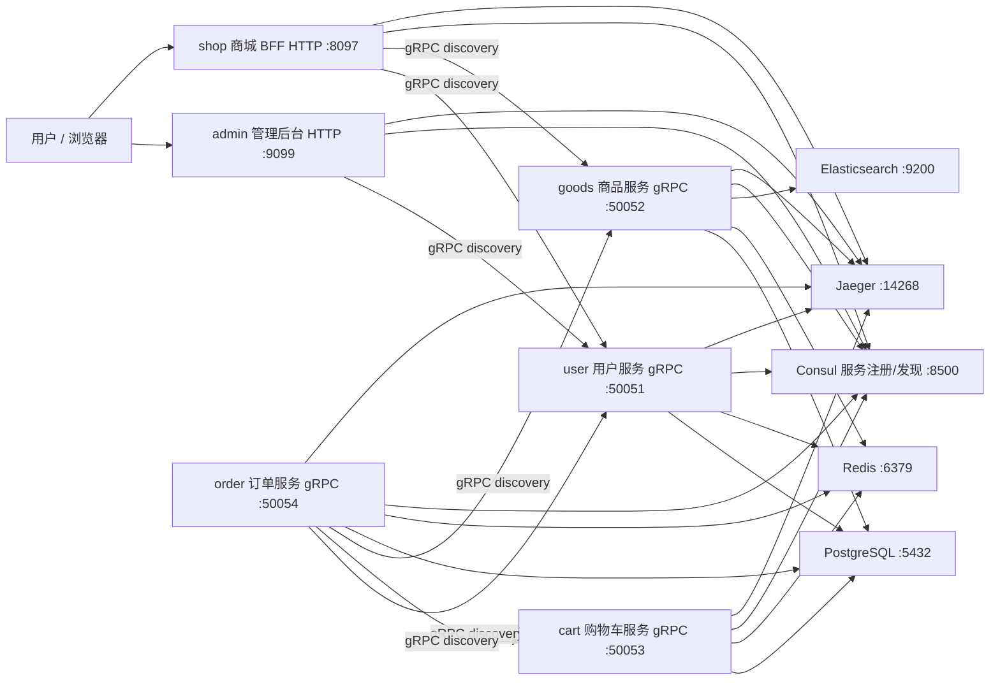
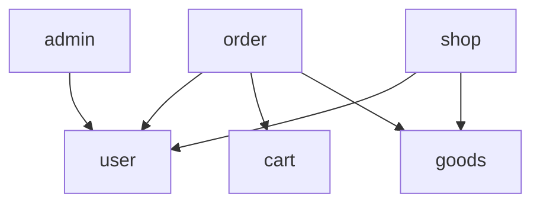

# 架构与微服务关系

## 总体架构

## 服务职责

| 服务 | 类型 | 端口 | 职责 |
| --- | --- | --- | --- |
| `admin` | HTTP | 9099 | 后台管理系统入口：登录、注册、用户与地址管理 |
| `shop` | HTTP | 8097 | 商城 BFF：面向 C 端聚合用户/商品能力，签发 JWT |
| `service/user` | gRPC | 50051 | 用户、密码校验、收货地址 CRUD |
| `service/goods` | gRPC | 50052 | 商品、SKU、分类、品牌、规格、属性、库存，并提供 ES 搜索 |
| `service/cart` | gRPC | 50053 | 购物车增删改查 |
| `service/order` | gRPC | 50054 | 创建订单，聚合 user/cart/goods 三个服务 |
| `service/inventory` | gRPC | 50055 | 库存查询、预占、确认扣减、释放，消费订单事件 |
| `service/payment` | gRPC | 50056 | 支付单创建与回调，发布支付结果事件 |

## 服务间调用关系

- `shop` 与 `admin` 不直接访问数据库，只通过 gRPC 调用底层服务。
- `order` 在创建订单时会通过 discovery 地址调用 `shop.user.service`、`shop.cart.service`、`shop.goods.service`。
- 所有 gRPC 服务以及 `shop`/`admin` 都会注册到 Consul，服务名分别为：
  - `shop.user.service`
  - `shop.goods.service`
  - `shop.cart.service`
  - `shop.order.service`
  - `shop.api`（BFF）
  - `admin.api`

## 数据库边界

每个微服务使用独立数据库，避免跨服务直接读写表：

| 服务 | 数据库 |
| --- | --- |
| `service/user` | `shop_user` |
| `service/goods` | `shop_goods` |
| `service/cart` | `shop_cart` |
| `service/order` | `shop_order` |
| `service/inventory` | `shop_inventory` |
| `service/payment` | `shop_payment` |

## 中间件链路

HTTP 入口（`shop` / `admin`）统一使用：

- `recovery`：异常恢复
- `validate`：参数校验
- `tracing`：OpenTelemetry 链路
- `selector + jwt`：白名单接口放行，其余接口校验 JWT
- `logging`：请求日志

gRPC 服务之间使用 `tracing.Client()` 与 `recovery.Recovery()` 传递链路和兜底恢复。
