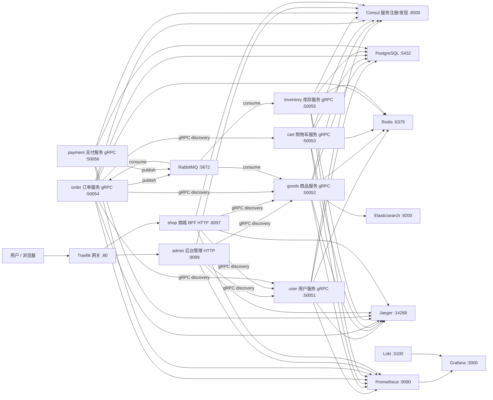
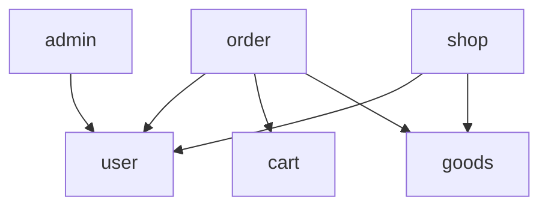

# 架构与微服务关系

## 总体架构

## 服务职责

| 服务 | 类型 | 端口 | 职责 |
| --- | --- | --- | --- |
| `admin` | HTTP | 9099 | 后台管理系统入口：登录、注册、用户与地址管理 |
| `shop` | HTTP | 8097 | 商城 BFF：面向 C 端聚合用户/商品能力，签发 JWT |
| `service/user` | gRPC | 50051 | 用户、密码校验、收货地址 CRUD |
| `service/goods` | gRPC | 50052 | 商品、SKU、分类、品牌、规格、属性、库存，并提供 ES 搜索 |
| `service/cart` | gRPC | 50053 | 购物车增删改查 |
| `service/order` | gRPC | 50054 | 创建订单，聚合 user/cart/goods 三个服务 |

## 什么是 BFF？

BFF（Backend for Frontend，面向前端/客户端的后端）是一种聚合层模式：前端不直接面对一堆微服务，而是只调用一个 HTTP 入口，由 BFF 负责组合、裁剪和转发。

本项目中有两个 BFF：

- `shop`（8097）：C 端商城 BFF。前端只依赖这一个地址，登录、用户信息、商品列表等请求由它通过 Consul 服务发现调用 user / goods 等 gRPC 服务，再组装成适合页面展示的 HTTP JSON；JWT 签发/刷新、接口限流也统一在这一层。
- `admin`（9099）：后台管理端 BFF。面向管理员的 HTTP 聚合入口，同样负责登录态与下游 gRPC 服务的协议转换。

使用 BFF 的好处：

- 前端接入简单，一个域名/端口即可访问业务能力；
- 服务拆分对前端透明，后端调整服务拆分不影响客户端；
- 协议转换（gRPC → HTTP/JSON）与按端裁剪数据（Web / App / 管理端）集中在同一层；
- 登录态、限流、鉴权等横切逻辑有统一的落点。

## 部署形态

项目提供三种部署形态，详见 README「服务启动」：

| 形态 | 说明 |
| --- | --- |
| Docker Compose 一键启动 | `make up`，本地体验整套环境最省事 |
| 本地手动启动 | `make infra-up` + 逐个启动二进制，适合开发调试 |
| 多服务器独立部署 | 每个服务独立二进制，通过同一个 Consul 互相发现 |
| Kubernetes | `deploy/k8s/` Kustomize 清单，适合集群化部署 |

## 可观测性

`make up` 会一并启动 Prometheus、Grafana、Loki、Traefik 等组件。每个服务暴露：

- 指标：`/metrics`（9101 ~ 9108）
- 健康检查：`/healthz`（9101 ~ 9108）

各组件的作用、访问地址与验证方法见 [开发指南](development.md) 第 6 节。
| `service/inventory` | gRPC | 50055 | 库存查询、预占、确认扣减、释放，消费订单事件 |
| `service/payment` | gRPC | 50056 | 支付单创建与回调，发布支付结果事件 |

## 服务间调用关系

- `shop` 与 `admin` 不直接访问数据库，只通过 gRPC 调用底层服务。
- `order` 在创建订单时会通过 discovery 地址调用 `shop.user.service`、`shop.cart.service`、`shop.goods.service`。
- 所有 gRPC 服务以及 `shop`/`admin` 都会注册到 Consul，服务名分别为：
  - `shop.user.service`
  - `shop.goods.service`
  - `shop.cart.service`
  - `shop.order.service`
  - `shop.api`（BFF）
  - `admin.api`

## 数据库边界

每个微服务使用独立数据库，避免跨服务直接读写表：

| 服务 | 数据库 |
| --- | --- |
| `service/user` | `shop_user` |
| `service/goods` | `shop_goods` |
| `service/cart` | `shop_cart` |
| `service/order` | `shop_order` |
| `service/inventory` | `shop_inventory` |
| `service/payment` | `shop_payment` |

## 中间件链路

HTTP 入口（`shop` / `admin`）统一使用：

- `recovery`：异常恢复
- `validate`：参数校验
- `tracing`：OpenTelemetry 链路
- `selector + jwt`：白名单接口放行，其余接口校验 JWT
- `logging`：请求日志

gRPC 服务之间使用 `tracing.Client()` 与 `recovery.Recovery()` 传递链路和兜底恢复。
